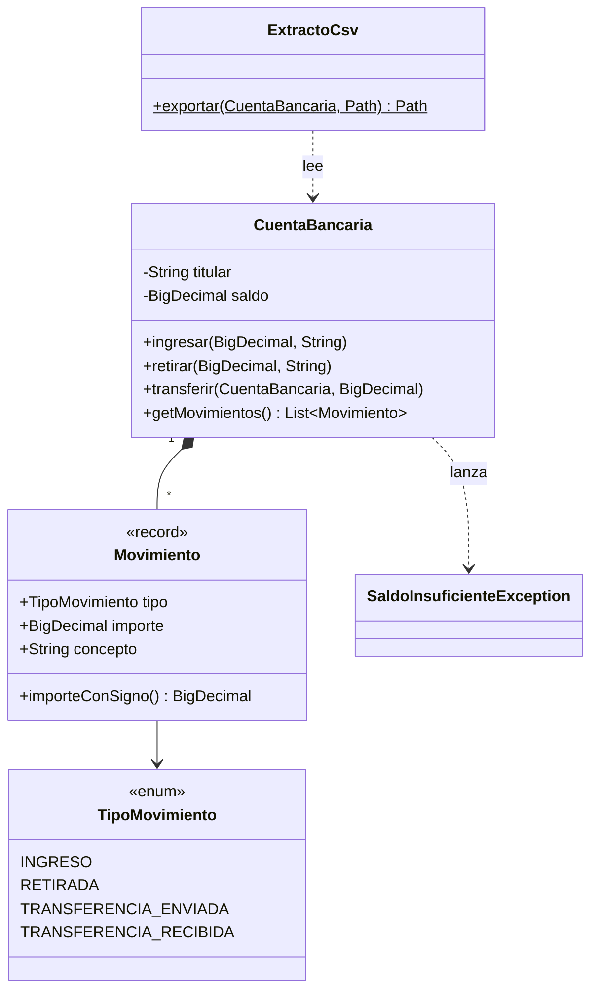

# Guía práctica de JUnit 6

[](https://github.com/sanchezcontentopablo-max/practica-junit6-endes/actions/workflows/ci.yml)


Guía **ejecutable** de JUnit 6: cada funcionalidad importante tiene un archivo de
test comentado que la explica y la demuestra sobre un mismo ejemplo, una
**cuenta bancaria**. Nació como práctica de *Entornos de Desarrollo* (1.º DAW)
y sirve como chuleta de consulta.

> **Cómo usarla:** abre el tema que te interese, lee el comentario de la clase
> y ejecuta sus tests desde el IDE. Cambia un valor para ver cómo falla y qué
> mensaje da JUnit.

## Índice

| Tema | Archivo | Qué aprendes |
|---|---|---|
| 1 | [Aserciones](src/test/java/edu/sanchezContentoPablo/junit6/guia/Tema01AsercionesTest.java) | `assertEquals`, `assertAll`, `assertThrows`, `assertIterableEquals`, `assertInstanceOf`… |
| 2 | [Ciclo de vida](src/test/java/edu/sanchezContentoPablo/junit6/guia/Tema02CicloDeVidaTest.java) | `@BeforeAll`, `@BeforeEach`, `@AfterEach`, `@AfterAll`, `TestInfo`, `@TestMethodOrder` |
| 3 | [Tests anidados](src/test/java/edu/sanchezContentoPablo/junit6/guia/Tema03AnidadosTest.java) | `@Nested` al estilo *dado / cuando / entonces*, `@DisplayNameGeneration` |
| 4 | [Parametrizados](src/test/java/edu/sanchezContentoPablo/junit6/guia/Tema04ParametrizadosTest.java) | `@ValueSource`, `@CsvSource`, `@CsvFileSource`, `@EnumSource`, `@MethodSource`, `@NullAndEmptySource` |
| 5 | [Repetidos y dinámicos](src/test/java/edu/sanchezContentoPablo/junit6/guia/Tema05RepetidosYDinamicosTest.java) | `@RepeatedTest`, `RepetitionInfo`, `@TestFactory`, `DynamicContainer` |
| 6 | [Asunciones y condiciones](src/test/java/edu/sanchezContentoPablo/junit6/guia/Tema06AsuncionesYCondicionesTest.java) | `assumeTrue`, `assumingThat`, `@EnabledOnOs`, `@EnabledForJreRange`, `@Disabled` |
| 7 | [Ficheros temporales](src/test/java/edu/sanchezContentoPablo/junit6/guia/Tema07FicherosTemporalesTest.java) | `@TempDir` como atributo y como parámetro |
| 8 | [Etiquetas y tiempos](src/test/java/edu/sanchezContentoPablo/junit6/guia/Tema08EtiquetasYTiemposTest.java) | `@Tag`, `@Timeout`, `assertTimeout`, filtrar tests con Maven |

## El ejemplo: una cuenta bancaria



Se usa `BigDecimal` en lugar de `double` porque con dinero `0.1 + 0.2` debe dar
exactamente `0.30`.

## Chuleta rápida

```java
@Test                                   // un test
@DisplayName("texto legible")           // nombre en el informe
@ParameterizedTest @CsvSource({"1, 2"}) // mismo test, varios datos
@Nested class Cuando_... { }            // agrupar por situación
@BeforeEach void preparar() { }         // antes de cada test
@TempDir Path carpeta;                  // carpeta temporal que se borra sola
@Tag("lento")                           // clasificar tests
@Timeout(1)                             // falla si tarda más de 1 s
@Disabled("motivo")                     // desactivar (con motivo)

assertEquals(esperado, real);           // SIEMPRE esperado primero
assertAll(() -> ..., () -> ...);        // varias comprobaciones a la vez
var e = assertThrows(MiError.class, () -> ...);
assumeTrue(condicion);                  // si no se cumple, el test se aborta
```

## Ejecutar

Requisitos: JDK 21+ y Maven 3.9+ (o el Maven integrado en IntelliJ IDEA).

```bash
mvn test                  # todos menos los etiquetados como "lento"
mvn test -Ptodos          # todos, incluidos los lentos
mvn test -Dgroups=rapido  # solo los etiquetados como "rapido"
mvn test -Dtest=Tema04*   # solo un tema
mvn verify                # tests + informe de cobertura en target/site/jacoco/
```

Resultado esperado: **83 tests**, de los cuales 2 se omiten a propósito
(el ejemplo de `@Disabled` y el test exclusivo de otro sistema operativo).
La integración continua los ejecuta en **Linux y Windows**.

## Flujo de trabajo

GitFlow: el trabajo se hace en `feature/sanchez-pablo`, se integra en `develop`
mediante *pull request* y las versiones estables llegan a `main`.

## Autor

**Pablo Sánchez Contento** · [GitHub](https://github.com/sanchezcontentopablo-max)
